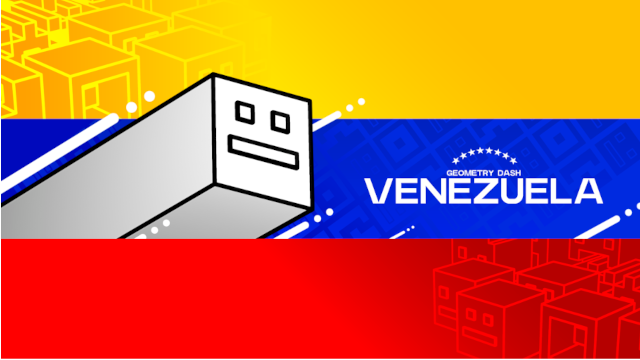

       

# GD Venezuela Bot

  

The GD Venezuela bot is designed to provide information to players from all over the country.
The information that the bot can provide are the statistics of each state of the country based on the roles assigned to users, mainly grinders, such as stars, moons, demons, user coins, etc. It can also provide complete information of the Venezuelan players on the [Demonlist](https://www.pointercrate.com/demonlist/), such as their global position, score and completed levels.

The option to link your Geometry Dash profile with the bot has been implemented to know in real time your stats and display them. All of this information is pulled from Robtop's servers.

The last feature that has been added to the bot is a small user XP monitoring system on the server that assigns a role to the most active users on the server. However, this task is a bit complicated, as the information is obtained from the ProBot bot by scraping. Maybe in the future it will be possible to automate it a bit more.

## Commands

| Command | Description |
| --- | --- |
| /estado grinders demon | Players dedicated to grindear demons |
| /estado grinders moon | Players dedicated to grindear moons |
| /estado grinders star | Players dedicated to grindear stars |
| /estado grinders user_coin | Players dedicated to grindear user coin |
| /estado info | Displays the information of a State of the country |
| /jugadores cantidad | Number of players per State of the country |
| /jugadores cp | List of players with creator points |
| /jugadores demonlist activos | List of active players on the Demonlist |
| /jugadores demonlist retirados | List of players removed from the Demonlist |
| /staff estado hardest | Defines the most difficult level completed in a State of the country |
| /staff hardest | Define the hardest in the country |
| /staff info | Server staff information |
| /staff jugador cp | Defines a player who has creator points |
| /hardest | The hardest level in the country completed by a player |
| /hardests | The most difficult levels completed in the whole country |
| /vincular | Link your Geometry Dash profile to the bot to enhance the bot's functionality |
| /utilidades top xp | Displays the leaderboard of the users with the most XP on the server (Top 15) |

## Secret commands (Authorised personnel only)

| Command | Description |
| --- | --- |
| --scan | Scan the Embeds sent by the ProBot bot to extract the leaderboard. Receives a parameter of type number indicating how many embeds to scan |
| --clean | Cleans a specific channel |

## Contribution

If you want to support the project, you can make a fork and make a pull request; there is no specific syntax to follow in the code, you can do it as you like. You need to have the latest version of NodeJS and discord-js v14.

## APIs

- [Pointercrate API](https://www.pointercrate.com/documentation/index)
- [All Rated Extreme Demon List API](https://github.com/All-Rated-Extreme-Demon-List/AREDL)

## Social Networks
- [GD Venezuela Discord Server](https://discord.gg/gdvenezuela)
- [X \(Twitter\)](https://x.com/GD_Venezuela)

*If you want to communicate with us to contribute to the project, join the Discord server!*